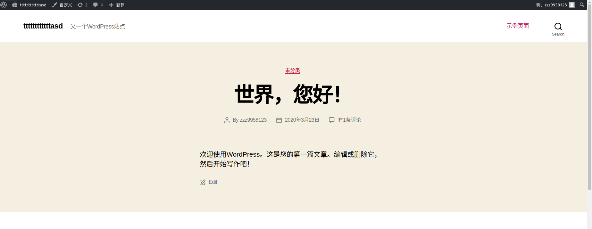

# Docker Compose and WordPress
**Reference from [urre/wordpress-nginx-docker-compose](https://github.com/urre/wordpress-nginx-docker-compose)**

[中文说明](README-cn.md)

Use WordPress locally with Docker using [Docker compose](https://docs.docker.com/compose/)

This setup comes shipped with:


+ Custom domain for example `myapp.local`
+ Custom nginx config in `./nginx`
+ Custom PHP `php.conf.ini` config in `./config`
+ Volumes for `nginx`, `wordpress` and `mariadb`
+ [PhpMyAdmin](https://www.phpmyadmin.net/) - free and open source administration tool for MySQL and MariaDB
+ [Goaccess](https://goaccess.io/) - GoAccess is an open source real-time web log analyzer and interactive viewer that runs in a terminal in *nix systems or through your browser.
+ CLI scripts
	- Create a self signed SSL certificate for using https
	- Trust certs in macOS System Keychain
	- Setup the local domain in your in `/etc/hosts`

## img



## Setup

### Requirements

+ [Docker](https://www.docker.com/get-started)
+ Openssl for creatng the SSL cert. 

### Setup environment variables

Easily set your own local domain, db settings and more. Start by creating `.env` files, like the examples below.

#### For Docker and the cli scripts

Copy `.env-example` in the project root to `.env` and edit your preferences.

Example:

```dotenv
IP=127.0.0.1
APP_NAME=myapp
DOMAIN="myapp.local"
DB_HOST=mysql
DB_NAME=myapp
DB_ROOT_PASSWORD=password
DB_TABLE_PREFIX=wp_

```


### Create SSL cert

```shell
cd cli
./create-cert.sh
```

> Note: OpenSSL needs to be installed.

### Trust the cert in macOS Keychain

Chrome and Safari will trust the certs using this script.

> In Firefox: Select Advanced, Select the Encryption tab, Click View Certificates. Navigate to where you stored the certificate and click Open, Click Import.

```shell
cd cli
./trust-cert.sh
```

### Add the local domain in /etc/hosts

To be able to use for example `https://myapp.local` in our browser, we need to modify the `/etc/hosts` file on our local machine to point the custom domain name. The `/etc/hosts` file contains a mapping of IP addresses to URLs.

```shell
cd cli
./setup-hosts-file.sh
```

> The helper script can both add or remove a entry from /etc/hosts. First enter the domain name, then press "a" for add, or "r" to remove. Follow the instructions on the screen.

## Run

```shell
docker-compose up -d
```

Docker Compose will start all the services for you:

```shell
Creating mysql ... done
Creating phpmyadmin ... done
Creating wordpress  ... done
Creating nginx      ... done
Creating goaccess   ... done
```

🚀 Open up [https://myapp.local](https://myapp.local)

## PhpMyAdmin

PhpMyAdmin comes installed as a service in docker-compose.

Open [http://127.0.0.1:8080/](http://127.0.0.1:8080/)

## Goaccess

Goaccess comes installed as a service in docker-compose.

Open [http://127.0.0.1:7889/](http://127.0.0.1:7889/)

## Notes:

When making changes to the Dockerfile, use:

```bash
docker-compose up -d --force-recreate --build
```
